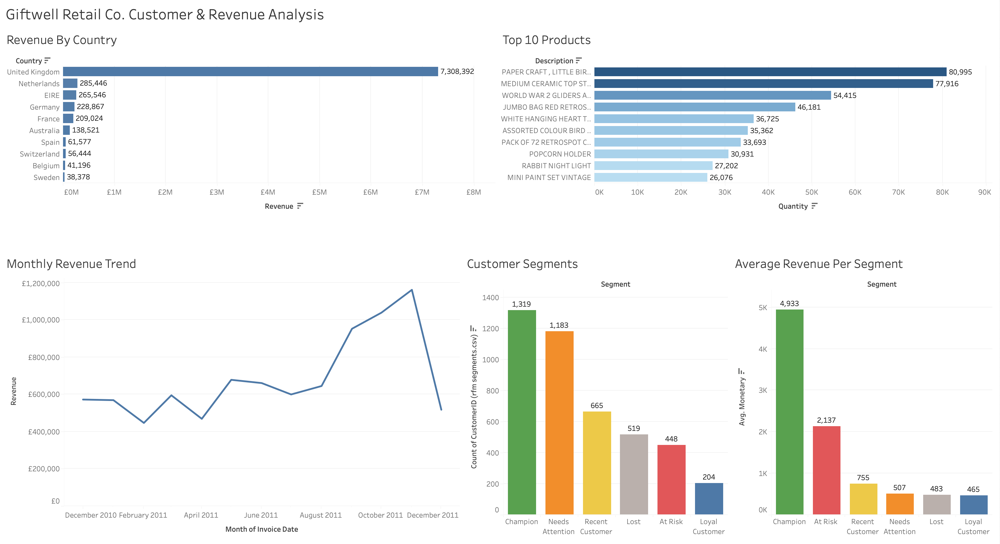
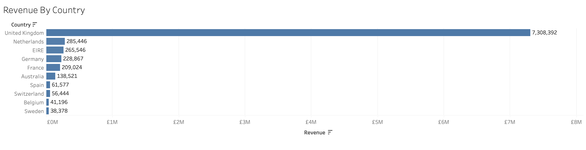
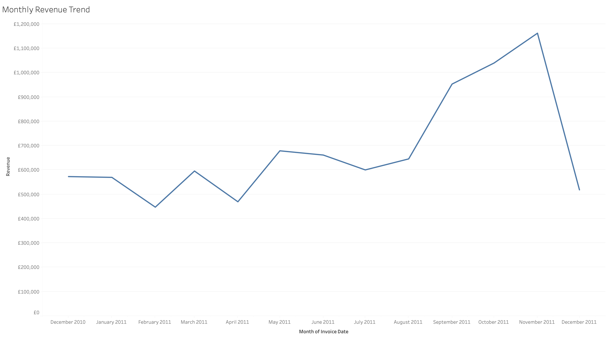
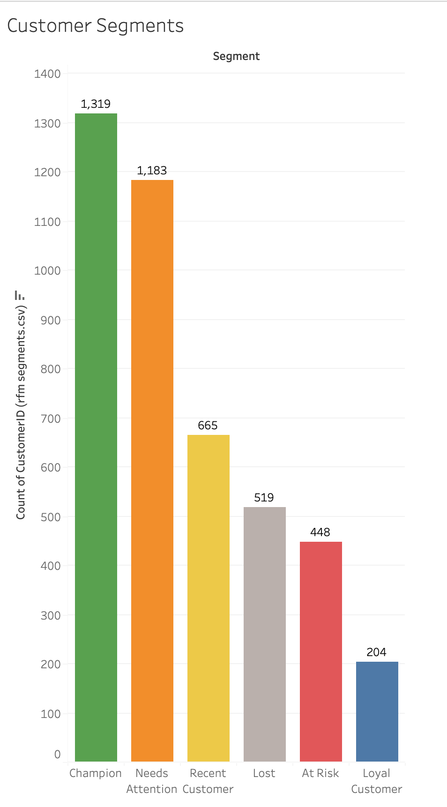
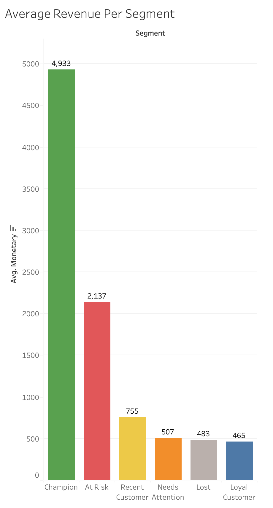
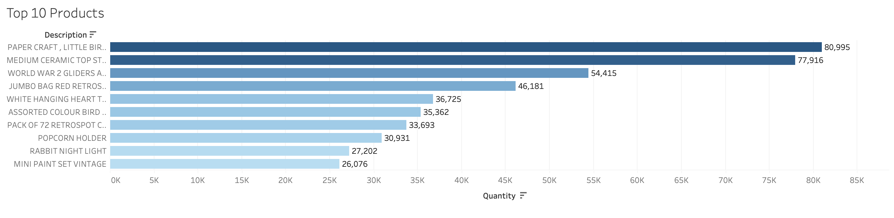
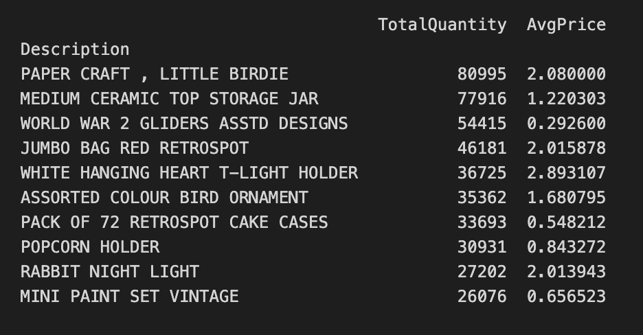

# Giftwell Retail Co. — Customer Segmentation & Revenue Analysis

## Client Background

**Giftwell Retail Co.** is a UK-based e-commerce retailer that sells giftware and home accessories, serving customers across 37 countries. The company processes hundreds of thousands of transactions annually through its online storefront, primarily serving wholesale and retail buyers across Europe and beyond.

Giftwell's transaction data spanning December 2010 to December 2011 was analysed to evaluate commercial performance, understand customer behaviour, and identify opportunities for revenue growth and retention. This analysis was done to support the marketing and operations teams in making data driven decisions.

The insights and recommendations focus on the following key focus areas:

- **Revenue Trends** — Monthly and geographic revenue performance
- **Product Performance** — Top selling products by volume
- **Customer Segmentation** — RFM segmentation of 4,338 customers
- **Retention Opportunities** — Identifying at risk and lost customers

---

## Business Questions
1. Which countries generate the most revenue?
2. How does revenue trend across the year, when does the revenue peak?
3. Who are the most valuable customers, and who is at risk of churning?
4. Which products drive the highest sales volume?

---

## Executive Summary

Giftwell Retail Co. generated **£8.5M in total revenue** across 397,884 transactions from 4,338 customers from December 1, 2010 to December 9, 2011.Revenue is dominated by the UK market, which accounts 
for **89% of total sales**, with the remaining 11% spread across 36 countries, mostly in Europe.

Revenue grew steadily through the year, with a notable acceleration beginning in September 2011 (£952K) — a 47% jump from August (£645K) and continuing through October (£1.03M) and peaking in November at 
**£1.16M**.  
December 2011 recorded  **£518K in just 9 days** of data, suggesting daily revenue was outpacing December 2010's full-month total of £572K.

The cause of this Q4 acceleration is not explained by the available data. 

RFM segmentation revealed that **Champions (1,319 customers)** are the most valuable segment, averaging **£4,933 in spend** — over 10x more than Lost customers. Meanwhile, 448 At Risk customers who previously averaged £2,137 each represent a significant and recoverable revenue opportunity.

---

## Data Cleaning & Preparation
The cleaning process before the anaysis consisted of:
- Removing 135,080 rows that had missing CustomerID values
- Removing cancelled transactions 
- Removing rows with negative or zero Quantity and UnitPrice values
- Changing CustomerID data type from float to string
- Resolving trailing whitespace in product descriptions causing lookup failures
- Adding a Revenue column (Quantity × UnitPrice)

**Result:** 397,884 clean transactions across 4,338 unique customers

---

## RFM Customer Segmentation Methodology

Customers were scored 1–4 on three dimensions:

- **Recency (R)** — how recently did the customer make a purchase? (4 = bought very recently, 1 = hasn't bought in a long time)
- **Frequency (F)** — how many times did they order? (4 = very frequent buyer, 1 = bought once)
- **Monetary (M)** — how much did they spend in total? (4 = high spender, 1 = low spender)

Scores were combined into a 3-digit RFM score (e.g. 444 = top customer on all three dimensions) and customers were classified into segments based on the following logic:

| Segment | Criteria |
|---|---|
| Champion | R≥3, F≥3, M≥3 — recent, frequent, high spend |
| Loyal Customer | R≥3, F≥3 — recent and frequent regardless of spend |
| At Risk | F≥3, M≥3, R<3 — valuable but haven't returned recently |
| Recent Customer | R≥3, F≤2 — bought recently but not yet frequently |
| Lost | R=1, F=1 — haven't bought in a long time, only bought once |
| Needs Attention | Everyone else, middle ground across all dimensions |

| Segment | Customers | Avg. Spend |
|---|---|---|
| Champion | 1,319 | £4,933 |
| Needs Attention | 1,183 | £507 |
| Recent Customer | 665 | £755 |
| Lost | 519 | £483 |
| At Risk | 448 | £2,137 |
| Loyal Customer | 204 | £465 |

---

## Key Findings

### 1. Revenue is heavily UK-concentrated
The United Kingdom accounts for £7.3M of total revenue which is over 89% of all sales. The remaining 11% is distributed across 36 countries. The Netherlands, Ireland, and Germany are the next largest markets generating between £209K–£285K each and together make up over 9% of the total revenue. This suggests organic international demand exists and is currently underleveraged.

### 2. Strong revenue spike in Q4
Revenue remains relatively stable between **£450K–£680K per month** from December 2010 through August 2011, before accelerating sharply in September (£952K), October (£1.03M), and peaking in November at **£1.16M** which is nearly double the monthly average. December 2011 recorded **£518K in just 9 days**, suggesting daily revenue was on pace to surpass any previous month. The cause of this acceleration is not conclusively explained by the available data, though seasonal wholesale restocking and holiday gifting demand are plausible contributing factors.

### 3. Champions dominate in both volume and value but a large retention opportunity exists
Giftwell's 1,319 Champions are the largest and most valuable segment, averaging **£4,933 in spend over the 12-month analysis period**. At Risk customers are the second highest spenders at **£2,137 average** despite being only 448 customers — meaning each recovered At Risk customer is worth significantly more than acquiring a new one. The 1,183 Needs Attention customers represent the largest untapped growth opportunity and are the second most common segment but averaging only **£507 in spend**, suggesting they have not yet been given sufficient reason to buy more frequently or at higher volumes.

  
  

### 4. Top selling products are low-price, high-volume wholesale items
The 10 best selling products by quantity are all priced under **£3**, with Paper Craft Little Birdie leading at **80,995 units** (£2.08 avg) and Medium Ceramic Top Storage Jar at **77,916 units** (£1.22 avg). This confirms a **high-volume, low-margin business model** where revenue is driven by bulk purchasing.
 

---

## Business Recommendations
Based on the findings above, the following actions are recommended for Giftwell's marketing and operations teams:

1. **Invest in international expansion while balancing the strong UK growth** — The UK market is Giftwell's proven stronghold and should remain the main focus. However, 89% revenue concentration in a single market represents a business risk. Markets like Germany, France, and the Netherlands show early traction and represent low risk expansion opportunities.

2. **Plan operations and inventory around the Q4 acceleration** - Giftwell should increase stock levels for in demand products ahead of September and scale staffing and logistics capacity to handle the demand spike. Failing to prepare operationally risks going out of stock and fulfilment delays during the most valuable period of the year.
   
3. **Prioritise retention of At Risk customers and conversion of Needs Attention customers** — 448 customers who previously spent £2,137 on average (over the analysis period) have gone quiet. Targeting this segment with personalised offers or discounts has clear ROI. Even recovering 20% of the 448 At Risk customers would generate approximately **£190K in additional revenue**. For the Needs Attention segment, targeted 
incentives such as volume discounts, product recommendations based on purchase history, or a loyalty programme could help convert a portion of these 1,183 customers into Loyal or Champion customers.

4. **Prioritise inventory for high-volume low-cost products ahead of Q4** — Given that revenue is driven by volume rather than margin, stockouts on best selling products during the Q4 surge would have an outsized impact on revenue. Paper Craft Little Birdie and Medium Ceramic Top Storage Jar alone account for over **158,000 units sold**. Ensuring sufficient stock of these items ahead of September is critical to capturing peak season demand.

---

## Tools & Technologies

- **Python (pandas)** — data cleaning, EDA, RFM segmentation
- **Tableau Public** — interactive dashboard
- **Jupyter Notebook** — analysis and documentation

---

## Files
- `explore.ipynb` — full Python analysis (cleaning, EDA, RFM segmentation)
- `clean_retail.csv` — cleaned transaction data
- `rfm_segments.csv` — customer RFM scores and segments
- [Live Tableau Dashboard](https://public.tableau.com/app/profile/dana.dobrosavljevic/viz/GiftwellRetailCo_CustomerRevenueAnalysis/Dashboard?publish=yes)
- **Dataset:** [UCI Online Retail Dataset](https://archive.ics.uci.edu/dataset/352/online+retail)
